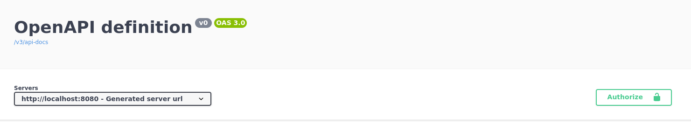

# Spring Boot 3: documente, teste e prepare uma API para o deploy

## Aula 1. Agendamento de consultas

- Implementar uma nova funcionalidade no projeto;
- Avaliar quando é necessário criar uma classe Service na aplicação;
- Criar uma classe Service, com o objetivo de isolar códigos de regras de negócio, utilizando para isso a anotação @Service;
- Implementar um algoritmo para a funcionalidade de agendamento de consultas;
- Realizar validações de integridade das informações que chegam na API;
- Implementar uma consulta JPQL (Java Persistence Query Language) complexa em uma interface repository, utilizando para isso a anotação @Query.

> https://trello.com/b/O0lGCsKb/api-voll-med

### Códigos para novas funcionalidades

- Controller
- DTO's
- Entidade JPA
- Repository
- Migration
- _Regras de negócios_

### Anotação @JsonAlias

Aprendemos que os nomes dos campos enviados no JSON para a API devem ser idênticos aos nomes dos atributos das classes DTO, pois assim o Spring consegue preencher corretamente as informações recebidas.

Entretanto, pode acontecer de um campo ser enviado no JSON com um nome diferente do atributo definido na classe DTO. Por exemplo, imagine que o seguinte JSON seja enviado para a API:
```
{
    “produto_id” : 12,
    “data_da_compra” : “01/01/2022”
}
```
E a classe DTO criada para receber tais informações seja definida da seguinte maneira:
```
public record DadosCompra(
    Long idProduto,
    LocalDate dataCompra
){}
```
Se isso ocorrer, teremos problemas, pois o Spring vai instanciar um objeto do tipo DadosCompra, mas seus atributos não serão preenchidos e ficarão como null em razão de seus nomes serem diferentes dos nomes dos campos recebidos no JSON.

Temos duas possíveis soluções para essa situação:

1. Renomear os atributos no DTO para terem o mesmo nome dos campos no JSON;

2. Solicitar que a aplicação cliente, que está disparando requisições para a API, altere os nomes dos campos no JSON enviado.

A primeira alternativa citada anteriormente não é recomendada, pois os nomes dos campos no JSON não estão de acordo com o padrão de nomenclatura de atributos utilizado na linguagem Java.

A segunda alternativa seria a mais indicada, porém, nem sempre será possível “obrigar” os clientes da API a alterarem o padrão de nomenclatura utilizado nos nomes dos campos no JSON.

Para essa situação existe ainda uma terceira alternativa, na qual nenhum dos lados (cliente e API) precisam alterar os nomes dos campos/atributos. Basta, para isso, utilizar a anotação `@JsonAlias`:
```
public record DadosCompra(
    @JsonAlias(“produto_id”) Long idProduto,
    @JsonAlias(“data_da_compra”) LocalDate dataCompra
){}
```
A anotação `@JsonAlias` serve para mapear “apelidos” alternativos para os campos que serão recebidos do JSON, sendo possível atribuir múltiplos alias:
```
public record DadosCompra(
    @JsonAlias({“produto_id”, “id_produto”}) Long idProduto,
    @JsonAlias({“data_da_compra”, “data_compra”}) LocalDate dataCompra
){}
```
Dessa forma resolvemos o problema, pois o Spring, ao receber o JSON na requisição, vai procurar os campos considerando todos os alias declarados na anotação `@JsonAlias`.


### Formatação de datas

Como foi demonstrado no vídeo anterior, o Spring tem um padrão de formatação para campos do tipo data quando esses são mapeados em atributos do tipo LocalDateTime. Entretanto, é possível personalizar tal padrão para utilizar outras formatações de nossa preferência.

Por exemplo, imagine que precisamos receber a data/hora da consulta no seguinte formato: `dd/mm/yyyy hh:mm`. Para que isso seja possível, precisamos indicar ao Spring que esse será o formato ao qual a data/hora será recebida na API, sendo que isso pode ser feito diretamente no DTO, com a utilização da anotação @JsonFormat:

```
@NotNull
@Future
@JsonFormat(pattern = "dd/MM/yyyy HH:mm")
LocalDateTime data
```

No atributo pattern indicamos o padrão de formatação esperado, seguindo as regras definidas pelo padrão de datas do Java. Você pode encontrar mais detalhes nesta página do JavaDoc.

Essa anotação também pode ser utilizada nas classes DTO que representam as informações que a API devolve, para que assim o JSON devolvido seja formatado de acordo com o pattern configurado. Além disso, ela não se restringe apenas à classe LocalDateTime, podendo também ser utilizada em atributos do tipo LocalDate e LocalTime.

### Service Pattern

O Padrão Service é muito utilizado na programação e seu nome é muito comentado. Mas apesar de ser um nome único, Service pode ser interpretado de várias maneiras: pode ser um Use Case (Application Service); um Domain Service, que possui regras do seu domínio; um Infrastructure Service, que usa algum pacote externo para realizar tarefas; etc.

Apesar da interpretação ocorrer de várias formas, a ideia por trás do padrão é separar as regras de negócio, as regras da aplicação e as regras de apresentação para que elas possam ser facilmente testadas e reutilizadas em outras partes do sistema.

Existem duas formas mais utilizadas para criar Services. Você pode criar Services mais genéricos, responsáveis por todas as atribuições de um Controller; ou ser ainda mais específico, aplicando assim o S do SOLID: Single Responsibility Principle (Princípio da Responsabilidade Única). Esse princípio nos diz que uma classe/função/arquivo deve ter apenas uma única responsabilidade.

Pense em um sistema de vendas, no qual provavelmente teríamos algumas funções como: Cadastrar usuário, Efetuar login, Buscar produtos, Buscar produto por nome, etc. Logo, poderíamos criar os seguintes Services: CadastroDeUsuarioService, EfetuaLoginService, BuscaDeProdutosService, etc.

Mas é importante ficarmos atentos, pois muitas vezes não é necessário criar um Service e, consequentemente, adicionar mais uma camada e complexidade desnecessária à nossa aplicação. Uma regra que podemos utilizar é a seguinte: se não houverem regras de negócio, podemos simplesmente realizar a comunicação direta entre os controllers e os repositories da aplicação.

### Novas versões do Spring Boot

**ATENÇÃO!**

No vídeo anterior foi utilizada a seguinte query para escolher um médico aleatório:
```
select m from Medico m
where
m.ativo = 1
and
m.especialidade = :especialidade
and
m.id not in(
    select c.medico.id from Consulta c
    where
    c.data = :data
)
order by rand()
limit 1
```
Entretanto, nas versões mais recentes do Hibernate, utilizadas nas versões mais recentes do Spring Boot, a comparação m.ativo = 1 não mais funciona.

Embora o atributo ativo seja do tipo Boolean e não Integer, o Hibernate fazia automaticamente a conversão de 1 para true. Porém, essa conversão deixou de ser feita pelo Hibernate, e com isso a query deve ser alterada para:
```
select m from Medico m
where
m.ativo = true
and
m.especialidade = :especialidade
and
m.id not in(
    select c.medico.id from Consulta c
    where
    c.data = :data
)
order by rand()
limit 1
```

## Aula 2. Regras de Negócio

- Isolar os códigos de validações de regras de negócio em classes separadas, utilizando nelas a anotação @Component do Spring;
- Finalizar a implementação do algoritmo de agendamento de consultas;
- Utilizar os princípios SOLID para deixar o código da funcionalidade de agendamento de consultas mais fácil de entender, evoluir e testar.

### Princípios SOLID

SOLID é uma sigla que representa cinco princípios de programação:

- Single Responsibility Principle (Princípio da Responsabilidade Única)
- Open-Closed Principle (Princípio Aberto-Fechado)
- Liskov Substitution Principle (Princípio da Substituição de Liskov)
- Interface Segregation Principle (Princípio da Segregação de Interface)
- Dependency Inversion Principle (Princípio da Inversão de Dependência)

Cada princípio representa uma boa prática de programação, que quando aplicadas facilita muito a sua manutenção e extensão. Tais princípios foram criados por Robert Martin, conhecido como Uncle Bob, em seu artigo [Design Principles and Design Patterns](http://staff.cs.utu.fi/~jounsmed/doos_06/material/DesignPrinciplesAndPatterns.pdf).

Estes dois episódios do podcast Hipsters.Tech foram dedicados ao tema SOLID:

- [Hipsters #129 - Práticas de Orientação a Objetos](https://cursos.alura.com.br/extra/hipsterstech/praticas-de-orientacao-a-objetos-hipsters-129-a453)

- [Hipsters #219 - SOLID: Código bom e bonito](https://cursos.alura.com.br/extra/hipsterstech/solid-codigo-bom-e-bonito-hipsters-ponto-tech-219-a649)

## Aula 3. Documentação da API

- Adicionar a biblioteca SpringDoc no projeto para que ela faça a geração automatizada da documentação da API;
- Analisar a documentação do SpringDoc para entender como realizar a sua configuração em um projeto;
- Acessar os endereços que disponibilizam a documentação da API nos formatos yaml e html;
- Utilizar o Swagger UI para visualizar e testar uma API Rest;
- Configurar o JWT na documentação gerada pelo SpringDoc.

### OpenAPI Initiative

A documentação é algo muito importante em um projeto, principalmente se ele for uma API Rest, pois nesse caso podemos ter vários clientes que vão precisar se comunicar com ela, necessitando então de uma documentação que os ensinem como realizar essa comunicação de maneira correta.

Por muito tempo não existia um formato padrão de se documentar uma API Rest, até que em 2010 surgiu um projeto conhecido como Swagger, cujo objetivo era ser uma especificação open source para design de APIs Rest. Depois de um tempo, foram desenvolvidas algumas ferramentas para auxiliar pessoas desenvolvedoras a implementar, visualizar e testar suas APIs, como o Swagger UI, Swagger Editor e Swagger Codegen, tornando-se assim muito popular e utilizado ao redor do mundo.

Em 2015, o Swagger foi comprado pela empresa SmartBear Software, que doou a parte da especificação para a fundação Linux. Por sua vez, a fundação renomeou o projeto para OpenAPI. Após isso, foi criada a OpenAPI Initiative, uma organização focada no desenvolvimento e evolução da especificação OpenAPI de maneira aberta e transparente.

A OpenAPI é hoje a especificação mais utilizada, e também a principal, para documentar uma API Rest. A documentação segue um padrão que pode ser descrito no formato yaml ou JSON, facilitando a criação de ferramentas que consigam ler tais arquivos e automatizar a criação de documentações, bem como a geração de códigos para consumo de uma API.

Você pode obter mais detalhes no [site oficial da OpenAPI Initiative](https://www.openapis.org/).

### Personalizando a documentação

É possível personalizar a documentação gerada pelo SpringDoc para a inclusão do token de autenticação. Além do token, podemos incluir outras informações na documentação que fazem parte da especificação OpenAPI, como, por exemplo, a descrição da API, informações de contato e de sua licença de uso.

Tais configurações devem ser feitas no objeto OpenAPI, que foi configurado na classe SpringDocConfigurations de nosso projeto:
```
@Bean
public OpenAPI customOpenAPI() {
    return new OpenAPI()
            .components(new Components()
                    .addSecuritySchemes("bearer-key",
                            new SecurityScheme()
                                    .type(SecurityScheme.Type.HTTP)
                                    .scheme("bearer")
                                    .bearerFormat("JWT")))
                    .info(new Info()
                            .title("Voll.med API")
                            .description("API Rest da aplicação Voll.med, contendo as funcionalidades de CRUD de médicos e de pacientes, além de agendamento e cancelamento de consultas")
                            .contact(new Contact()
                                    .name("Time Backend")
                                    .email("backend@voll.med"))
                    .license(new License()
                            .name("Apache 2.0")
                            .url("http://voll.med/api/licenca")));
}
```
Usando os imports:
```
import io.swagger.v3.oas.models.info.Contact;
import io.swagger.v3.oas.models.info.Info;
import io.swagger.v3.oas.models.Components;
import io.swagger.v3.oas.models.OpenAPI;
import io.swagger.v3.oas.models.info.License;
import io.swagger.v3.oas.models.security.SecurityScheme;
import org.springframework.context.annotation.Bean;
import org.springframework.context.annotation.Configuration;
```
No código anterior, repare que após a configuração do token JWT foram adicionadas as informações da API. Ao entrar novamente na página do Swagger UI, tais informações serão exibidas, conforme demonstrado na imagem a seguir:



alt text: Página do Swagger Ui exibindo as informações da Voll.med API, onde se lê a mensagem “API Rest da aplicação Voll.med, contendo as funcionalidades de CRUD de médicos e de pacientes, além de agendamento e cancelamento de consultas.”

Para saber mais detalhes sobre quais informações podem ser configuradas na [documentação da API](https://spec.openapis.org/oas/latest.html#schema), consulte a especificação OpenAPI no site oficial da iniciativa.
